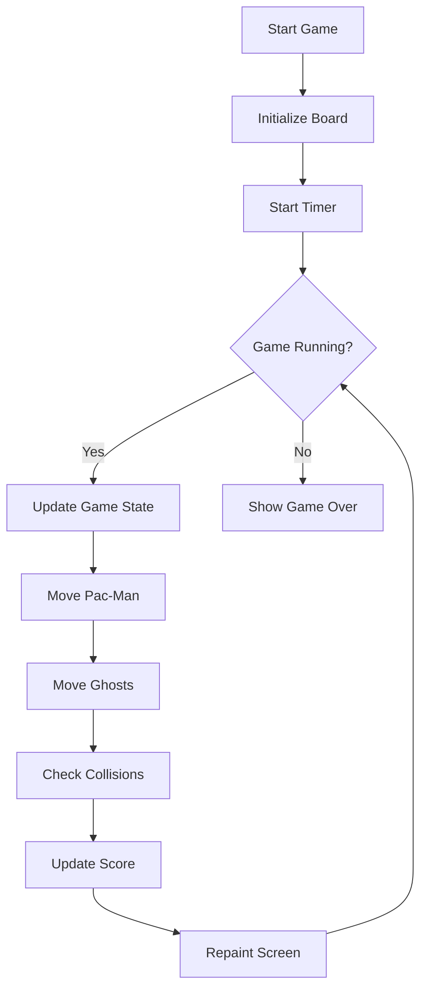
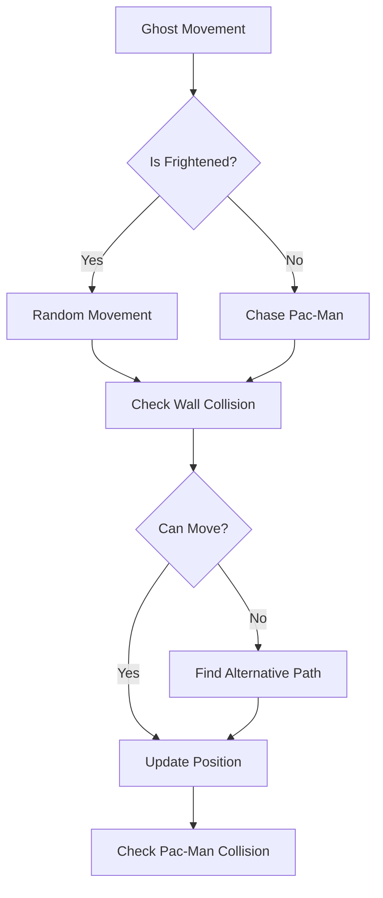
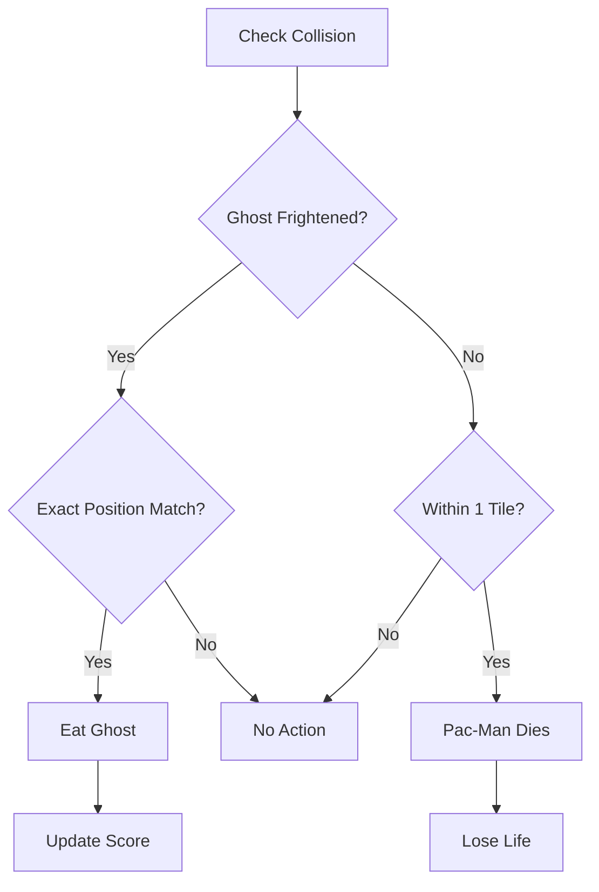

# Java Pac-Man Game

A classic Pac-Man game implementation in Java using Swing. This game features authentic Pac-Man mechanics, ghost AI, power pellets, and multiple levels.

## Table of Contents
- [Game Overview](#game-overview)
- [Features](#features)
- [Controls](#controls)
- [Game Mechanics](#game-mechanics)
- [Technical Details](#technical-details)
- [Class Structure](#class-structure)
- [Flowcharts](#flowcharts)
- [Installation](#installation)
- [Running the Game](#running-the-game)

## Game Overview

The game is a faithful recreation of the classic Pac-Man arcade game, featuring:
- Classic maze layout
- Four ghosts with different behaviors
- Power pellets
- Score system
- Multiple levels with increasing difficulty
- Lives system
- Animated characters and effects

## Features

- **Authentic Gameplay**: Classic Pac-Man mechanics and feel
- **Ghost AI**: Each ghost has unique behavior patterns
- **Power Pellets**: Turn ghosts blue and make them vulnerable
- **Multiple Levels**: Increasing difficulty with faster ghosts
- **Score System**: Points for dots, power pellets, and eating ghosts
- **Visual Effects**: 
  - Animated Pac-Man mouth
  - Ghost animations
  - Screen transitions
  - Decorative elements
- **Sound Effects**: (Coming soon)

## Controls

- **Arrow Keys**: Move Pac-Man
- **S**: Start new game
- **ESC**: Pause game
- **Space**: (Coming soon - Hard drop)

## Game Mechanics

### Scoring System
- Dots: 10 points
- Power Pellets: 50 points
- Eating Ghosts: 200 points each

### Ghost Behavior
1. **Normal Mode**:
   - Ghosts actively chase Pac-Man
   - Each ghost has slightly different targeting behavior
   - Collision results in losing a life

2. **Frightened Mode** (after eating power pellet):
   - Ghosts turn blue
   - Move slower and randomly
   - Can be eaten by Pac-Man
   - Lasts for a limited time

### Level Progression
- Each level increases ghost speed
- All dots must be eaten to advance
- Score and lives carry over between levels

## Technical Details

### Game Constants
```java
TILE_SIZE = 20        // Size of each tile in pixels
N_ROWS = 21          // Number of rows in maze
N_COLS = 19          // Number of columns in maze
N_GHOSTS = 4         // Number of ghosts
FRIGHTENED_DURATION = 100  // How long ghosts stay frightened
```

### Maze Data Structure
The maze is represented using a 2D array where:
- 0 = Dot
- 1 = Wall
- 2 = Power Pellet
- P = Pac-Man start
- G = Ghost start
- E = Empty space

## Class Structure

### Main Classes
1. **PacManGame** (JFrame)
   - Main game window
   - Initializes the game board

2. **Board** (JPanel)
   - Game board implementation
   - Handles game logic
   - Manages rendering
   - Controls game state

### Key Components
- **Game State Management**
  - Lives tracking
  - Score management
  - Level progression
  - Ghost states

- **Collision Detection**
  - Ghost collision (dying)
  - Ghost eating (when frightened)
  - Wall collision
  - Dot collection

- **Rendering System**
  - Maze drawing
  - Character animations
  - UI elements
  - Screen transitions

## Flowcharts

### Main Game Loop


### Ghost Movement Logic


### Collision Detection


## Installation

1. Ensure you have Java JDK 8 or later installed
2. Clone the repository
3. Navigate to the project directory

## Running the Game

### From Source
```bash
javac PacManGame.java
java PacManGame
```

### From JAR
```bash
java -jar PacMan.jar
```

## Future Improvements

1. **Planned Features**:
   - Sound effects
   - High score system
   - Additional ghost behaviors
   - More levels
   - Custom mazes

2. **Technical Improvements**:
   - Performance optimization
   - Code refactoring
   - Additional unit tests
   - Configuration system

## Contributing

Feel free to submit issues and enhancement requests!
And improve it!
---
## Author

John Morfidis.